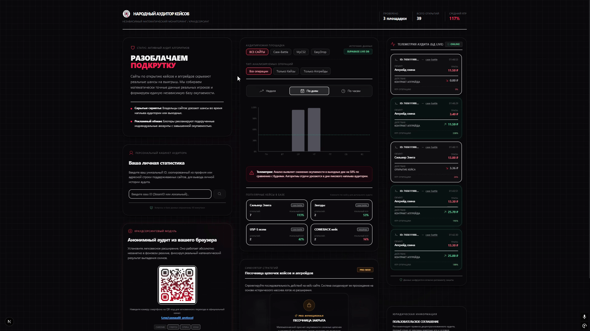

# Протокол «Народный Аудитор Кейсов» — Browser Extension (v1.2.0)

Официальное браузерное расширение для независимого децентрализованного аудита, фиксации реальной отдачи (RTP) и разоблачения манипуляций вероятностями на популярных кейс-площадках: Case-Battle, MyCS2 и EasyDrop.

<!-- ПОЛЕ ДЛЯ ВАШЕЙ ГИФКИ ПО УСТАНОВКЕ (Сохраните вашу гифку в корень репозитория под именем install-guide.gif) -->

  

---

## БЕЗОПАСНОСТЬ И 100% АНОНИМНОСТЬ (GDPR COMPLIANT)

Расширение спроектировано по строгим промышленным стандартам безопасности и не собирает никаких личных данных:

* **БЕЗ авторизации через Steam:** Расширение физически не имеет доступа к вашему аккаунту Steam, паролям, мобильному аутентификатору (Steam Guard) или торговым сессиям.
* **БЕЗ сбора персональных данных:** Мы категорически не собираем ваши куки-файлы, платежные реквизиты, историю посещения других сайтов или IP-адреса.
* **Сухие математические данные:** В базу данных шлюза передаются исключительно анонимные параметры совершенных транзакций (затраты на операцию, стоимость выпавшего предмета, тип действия и название объекта).

---

## ИНСТРУКЦИЯ ПО РУЧНОЙ УСТАНОВКЕ (ЗА 10 СЕКУНД)

Поскольку расширение распространяется по независимой децентрализованной модели без цензуры со стороны магазинов приложений, установка выполняется вручную в режиме разработчика:

1. Перейдите в наш официальный Telegram-канал и скачайте актуальный ZIP-архив с расширением: **[Вступить в Telegram-канал](https://t.me/caseaudit_protocol)**.
2. Распакуйте скачанный ZIP-архив в любую удобную папку на вашем компьютере.
3. Откройте ваш браузер на базе Chromium (Google Chrome, Яндекс.Браузер, Opera, Microsoft Edge) и перейдите по техническому адресу: `chrome://extensions/`
4. В правом верхнем углу включите тумблер **«Режим разработчика»** (Developer mode).
5. В левом верхнем углу нажмите кнопку **«Загрузить распакованное расширение»** (Load unpacked).
6. Выберите распакованную папку из Шага 2.
7. Расширение установлено. Закрепите иконку аудитора на панели задач вашего браузера.

---

## ВАЖНО: КАК ПРИВЯЗАТЬ СВОЙ ID (РУЧНОЙ ВВОД)

Для безопасности ваших данных мы отключили автоматический скрытый сбор ID, чтобы при переходе на профили чужих игроков ваш личный ID не перезаписывался. Скопируйте и введите ваш ID вручную в попапе расширения:

* **На Case-Battle:** Перейдите в свой профиль. Скопируйте длинное число из адресной строки браузера (например, в ссылке `https://case-battle.vip/user/76561198896509696` вашим ID является `76561198896509696`).
* **На MyCS2:** Перейдите в свой профиль. Под вашим игровым ником найдите и скопируйте текстовую строку вида `ID: 1240282`.
* **На EasyDrop:** Перейдите в личный кабинет. В блоке информации найдите и скопируйте строку вида `ID: 3675463`.

После ввода вашего ID в попапе плавающее окно на сайтах моментально обновится и загорится зеленым цветом, подтверждая активность личной статистики.

---

## АНАЛИТИЧЕСКИЙ ПОРТАЛ

Все собранные анонимные логи со всего мира агрегируются и выводятся в виде интерактивных графиков, почасовых срезов и дневной статистики на нашем официальном дашборде: **[caseaudit.online](https://caseaudit.online)**.

## СООБЩЕСТВО И СВЯЗЬ

Вся координация децентрализованного сбора логов, публикация еженедельных отчетов RTP и обсуждение алгоритмов урезания шансов проходят в нашем сообществе:
* **Telegram:** [t.me/caseaudit_protocol](https://t.me/caseaudit_protocol)

## ЛИЦЕНЗИЯ

Данный проект является полностью открытым и распространяется под свободной лицензией **MIT License**. Подробный текст лицензии и ограничения ответственности изложены в файле `LICENSE`.
